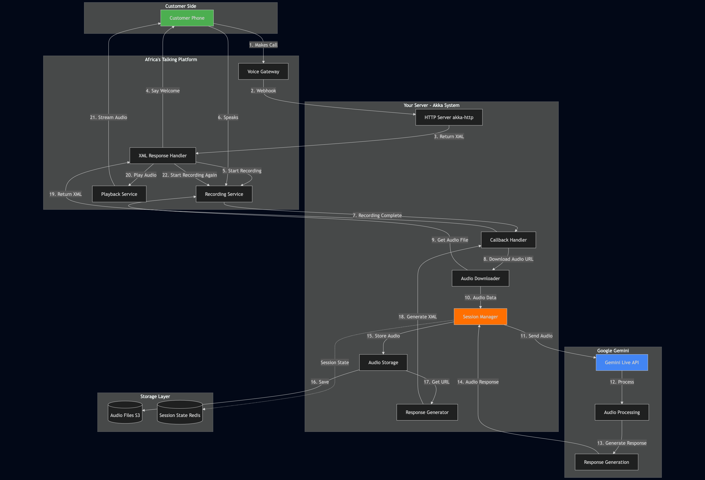
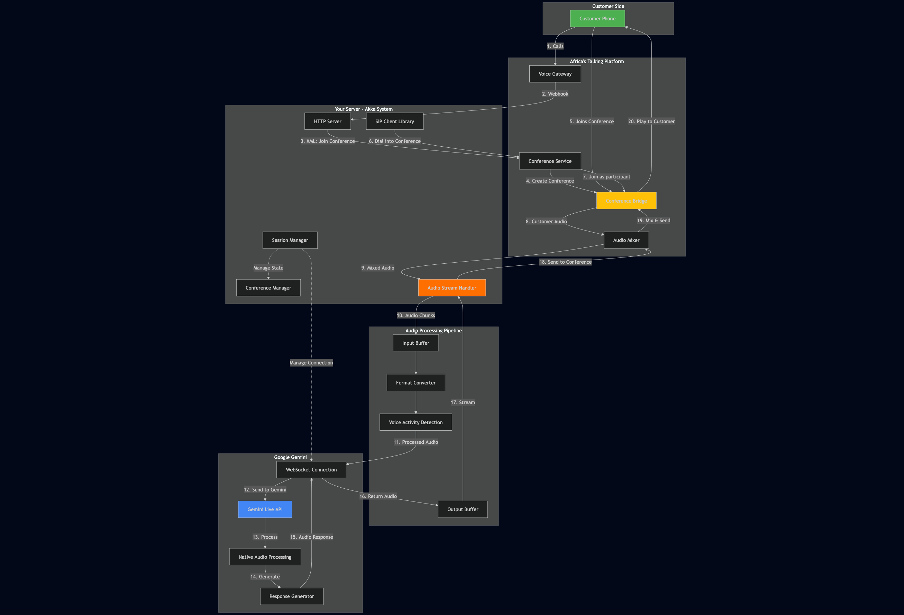

# Building, Securing, and Deploying Full-Stack Applications

## Africa's Talking + Google Gemini Integration Course

> **A comprehensive guide to building production-ready, multi-channel AI applications using Africa's Talking APIs, and
Google Gemini AI**

---

## Course Overview

This course teaches you how to architect, secure, and deploy intelligent applications that users can interact with
through **Voice** and **SMS** channels. You'll learn to build fault-tolerant, scalable systems using industry best
practices and modern cloud infrastructure.

### What Makes This Course Unique?

- **Production-Ready Code**: Not toy examples - real, battle-tested patterns
- **Multi-Channel AI**: Build once, deploy to Voice and SMS
- **End-to-End Coverage**: From architecture to monitoring
- **Cloud-Native**: Designed for Google Cloud Platform
- **Security-First**: Production security baked in from day one

---

## Learning Objectives

By the end of this course, you will be able to:

✅ Design and implement **multi-channel AI systems** (Voice + SMS)   
✅ Integrate **Google Gemini AI** for natural language processing  
✅ Implement **production-grade security** (encryption, authentication, rate limiting)  
✅ Version APIs **properly** with backward compatibility  
✅ Deploy to **Google Cloud Run** with auto-scaling  
✅ Set up **comprehensive monitoring** (Prometheus + Grafana)  
✅ Implement **CI/CD pipelines** with GitHub Actions  
✅ Handle **production incidents** with confidence

## Course Modules

### Module 1: Architecture & System Design

### Module 2: Security Best Practices

### Module 3: Voice AI Implementation

### Module 4: SMS AI Implementation

### Module 5: API Versioning & Lifecycle Management

### Module 6: Cloud Deployment & Scaling

### Module 7: Monitoring, Logging & Production Readiness

# Module 1: Architecture & System Design

Learn how to design scalable, multi-channel AI systems:

- Three-tier architecture overview
- Voice AI system design (3 approaches - focus on simplest)
- SMS AI architecture
- Database design
- Key architectural decisions

## 1.1 Understanding Multi-Channel AI Architecture

### Three-Tier Architecture Overview

```
┌─────────────────────────────────────────────────────────────────┐
│                    PRESENTATION LAYER                           │
│  ┌──────────────┐        ┌──────────────┐        ┌────────────┐ │
│  │ Voice Channel│        │  SMS Channel │        │ USSD (opt) │ │
│  │ (AT Voice)   │        │  (AT SMS)    │        │            │ │
│  └──────┬───────┘        └──────┬───────┘        └─────┬──────┘ │
└─────────┼───────────────────────┼──────────────────────┼────────┘
          │                       │                      │
          │      Webhook Events   │                      │
          ▼                       ▼                      ▼
┌─────────────────────────────────────────────────────────────────┐
│                  APPLICATION LAYER (Your Backend)               │
│  ┌───────────────────────────────────────────────────────────┐  │
│  │               HTTP Server (Scala)                         │  │
│  │  ┌────────────┐  ┌────────────┐  ┌──────────────────┐     │  │
│  │  │  Webhook   │  │  Session   │  │  Request/Response│     │  │
│  │  │  Handlers  │  │  Manager   │  │  Router          │     │  │
│  │  └─────┬──────┘  └─────┬──────┘  └────────┬─────────┘     │  │
│  │        │               │                    │             │  │
│  │  ┌─────▼───────────────▼────────────────────▼─────────┐   │  │
│  │  │        Business Logic Layer                       │    │  │
│  │  │  - Call Session Actors                            │    │  │
│  │  │  - SMS Conversation Actors                        │    │  │
│  │  │  - Context Management                             │    │  │
│  │  └───────────────────┬───────────────────────────────┘    │  │
│  └──────────────────────┼────────────────────────────────────┘  │
└─────────────────────────┼───────────────────────────────────────┘
                          │
                          │ API Calls
                          ▼
┌─────────────────────────────────────────────────────────────────┐
│                  INTEGRATION LAYER                              │
│  ┌──────────────────┐           ┌──────────────────────────┐    │
│  │ Google Gemini AI │           │  Africa's Talking API    │    │
│  │  - Text Generation│          │  - Outbound Calls        │    │
│  │  - Context Aware  │          │  - SMS Sending           │    │
│  │  - Streaming      │          │  - Voice Control         │    │
│  └──────────────────┘           └──────────────────────────┘    │
└─────────────────────────────────────────────────────────────────┘
                          │
                          ▼
┌─────────────────────────────────────────────────────────────────┐
│                     DATA LAYER                                  │
│  ┌──────────────┐  ┌──────────────┐  ┌──────────────────────┐   │
│  │  PostgreSQL  │  │    Redis     │  │  Cloud Storage       │   │
│  │  (Sessions)  │  │  (Cache)     │  │  (Audio Recordings)  │   │
│  └──────────────┘  └──────────────┘  └──────────────────────┘   │
└─────────────────────────────────────────────────────────────────┘
```

### Voice AI System Design - Three Approaches

#### Approach 1: Traditional IVR with Recording (RECOMMENDED - Simplest)


### Detailed Data Flow

```
┌─────────────────────────────────────────────────────────────────┐
│                    TURN 1: Customer Speaks                       │
└─────────────────────────────────────────────────────────────────┘

1. Customer calls AT number
   ↓
2. AT sends webhook to your server:
   POST /callbacks/voice
   {
     "sessionId": "abc123",
     "callerNumber": "+254712345678",
     "callId": "call-xyz"
   }
   ↓
3. Your server responds with XML:
   <?xml version="1.0"?>
   <Response>
     <Say>Welcome! How can I help?</Say>
     <Record 
       maxLength="60" 
       timeout="5"
       finishOnKey="#"
       callbackUrl="https://yourserver.com/callbacks/voice/audio/abc123"
     />
     <Redirect>https://yourserver.com/callbacks/voice/continue/abc123</Redirect>
   </Response>
   ↓
4. AT plays welcome message
   ↓
5. AT starts recording customer speech
   ↓
6. Customer speaks (up to 60 seconds or presses #)
   ↓
7. AT stops recording and posts to callback:
   POST /callbacks/voice/audio/abc123
   {
     "recordingUrl": "https://at-audio.s3.amazonaws.com/recording123.wav",
     "duration": "15",
     "callId": "call-xyz"
   }
   ↓
8. Your server downloads audio from recordingUrl
   ↓
9. Your server sends audio to Gemini Live API:
   WebSocket Message: {
     "client_content": {
       "turns": [{
         "role": "user",
         "parts": [{"inline_data": {"data": "base64audio..."}}]
       }]
     }
   }
   ↓
10. Gemini processes and responds with audio
    ↓
11. Your server saves response audio to storage (S3/local)
    ↓
12. Your server generates audio URL:
    https://yourserver.com/audio/responses/abc123/turn1.mp3
    ↓

┌─────────────────────────────────────────────────────────────────┐
│                    TURN 2: AI Responds                           │
└─────────────────────────────────────────────────────────────────┘

13. AT requests next action:
    GET /callbacks/voice/continue/abc123
    ↓
14. Your server responds with XML:
    <Response>
      <Play>https://yourserver.com/audio/responses/abc123/turn1.mp3</Play>
      <Record 
        maxLength="60" 
        timeout="5"
        finishOnKey="#"
        callbackUrl="https://yourserver.com/callbacks/voice/audio/abc123"
      />
      <Redirect>https://yourserver.com/callbacks/voice/continue/abc123</Redirect>
    </Response>
    ↓
15. AT plays AI response audio
    ↓
16. AT starts recording customer again
    ↓
17. LOOP: Repeat from step 6 until call ends

┌─────────────────────────────────────────────────────────────────┐
│                    Call End                                      │
└─────────────────────────────────────────────────────────────────┘

18. Customer hangs up OR timeout occurs
    ↓
19. AT sends webhook:
    POST /callbacks/voice/events/abc123
    { "event": "CallCompleted", "duration": "180" }
    ↓
20. Your server cleans up session
```

### Pros ✅

1. **Simplicity**
    - Standard HTTP webhooks (no WebSockets during call)
    - Easy to debug with tools like Postman
    - Clear request/response flow

2. **Reliability**
    - AT handles recording reliability
    - Your server just processes files
    - Easy retry logic

3. **Cost-Effective**
    - No persistent connections
    - Pay only for AT recording/playback
    - Efficient server resource usage

4. **Easy Development**
    - Can test locally with ngrok
    - Mock AT callbacks easily
    - Standard REST API patterns

5. **Scalability**
    - Stateless HTTP handlers
    - Easy horizontal scaling
    - No connection pooling needed

6. **Debugging**
    - Can download and replay recordings
    - Clear audit trail
    - Easy to reproduce issues

### Cons ❌

1. **Latency**
    - 2-4 seconds between turns
    - User must wait for complete response
    - Feels less natural

2. **No Interruption**
    - Customer can't interrupt AI
    - Must wait for AI to finish speaking
    - Can be frustrating for users

3. **Turn-Based Only**
    - Not a real conversation
    - Sequential, not simultaneous
    - Less natural flow

4. **User Experience**
    - Feels like traditional IVR
    - "Please wait" moments
    - Less engaging

5. **Storage Requirements**
    - Must store audio files
    - S3 or similar needed
    - File management overhead

6. **Timeout Limitations**
    - Max recording length (usually 60s)
    - Silence timeout (3-5s)
    - May cut off long responses

### Best For
- ✅ MVP and prototypes
- ✅ Simple customer service
- ✅ FAQ bots
- ✅ Surveys and data collection
- ✅ Low-budget projects
- ✅ When simplicity > naturalness

---



#### Approach 2: Conference-Based Approach

### Overview
Create a conference call, join it programmatically, stream audio bidirectionally through conference

### Detailed Data Flow

```
┌─────────────────────────────────────────────────────────────────┐
│                    SETUP: Conference Creation                    │
└─────────────────────────────────────────────────────────────────┘

1. Customer calls AT number
   ↓
2. AT sends webhook:
   POST /callbacks/voice
   {"sessionId": "abc123", "callerNumber": "+254712345678"}
   ↓
3. Your server creates unique conference room: "room-abc123"
   ↓
4. Your server responds with XML:
   <Response>
     <Say>Connecting you to our AI agent.</Say>
     <Dial>
       <Conference 
         beep="false" 
         startConferenceOnEnter="true"
         waitUrl=""
         statusCallback="https://yourserver.com/callbacks/conference/abc123">
         room-abc123
       </Conference>
     </Dial>
   </Response>
   ↓
5. AT creates conference "room-abc123"
   ↓
6. Customer joins conference (participant 1)
   ↓
7. Your server programmatically joins same conference:
   
   // Using AT API or SIP
   africaTalkingService.dialIntoConference(
     conferenceId = "room-abc123",
     phoneNumber = config.sipEndpoint // Your SIP server
   )
   ↓
8. Your server joins as participant 2
   ↓

┌─────────────────────────────────────────────────────────────────┐
│                CONTINUOUS: Bidirectional Audio Flow              │
└─────────────────────────────────────────────────────────────────┘

9. Conference bridge mixes audio from all participants
   ↓
10. Your server receives customer audio stream:
    ┌────────────────────────────────┐
    │ RTP Packets (every 20ms)      │
    │ - Sequence number             │
    │ - Timestamp                   │
    │ - Audio payload (320 bytes)   │
    └────────────────────────────────┘
    ↓
11. Audio processing pipeline:
    Raw Audio → Buffer → Format Convert → VAD → Gemini
    ↓
12. Gemini processes in real-time:
    - Detects when customer starts speaking
    - Detects when customer stops speaking
    - Generates response while listening
    ↓
13. Gemini returns audio stream:
    ┌────────────────────────────────┐
    │ Audio chunks (real-time)      │
    │ - Can interrupt customer      │
    │ - Natural overlapping         │
    └────────────────────────────────┘
    ↓
14. Your server sends to conference:
    Audio Buffer → Format Convert → RTP → Conference Bridge
    ↓
15. Conference mixes and sends to customer
    ↓
16. SIMULTANEOUS: Steps 10-15 happen continuously
    - No turn-taking
    - Real-time mixing
    - Natural interruption

┌─────────────────────────────────────────────────────────────────┐
│                    TEARDOWN: Call End                            │
└─────────────────────────────────────────────────────────────────┘

17. Customer or AI ends call
    ↓
18. Conference status callback:
    POST /callbacks/conference/abc123
    {
      "event": "ParticipantLeft",
      "participantNumber": "+254712345678"
    }
    ↓
19. Your server leaves conference
    ↓
20. Conference destroyed
    ↓
21. Cleanup and save conversation history
```

### Pros ✅

1. **Better User Experience**
    - 1-2 second latency
    - More natural flow
    - Less waiting between turns

2. **Bidirectional Audio**
    - Both parties in same "room"
    - Conference mixing handles timing
    - Can detect interruptions

3. **Flexible Architecture**
    - Your server is a conference participant
    - Can add more participants (human agents)
    - Good for escalation scenarios

4. **Better Than Record-Based**
    - Faster response time
    - More engaging
    - Professional feel

5. **AT Native Feature**
    - Built into Africa's Talking
    - Well-documented
    - Supported API

6. **Moderate Complexity**
    - More complex than record-based
    - Simpler than full SIP/WebRTC
    - Good middle ground

### Cons ❌

1. **More Complex**
    - Need to programmatically join conference
    - Audio streaming logic required
    - State management harder

2. **Cost**
    - Conference minutes charged
    - Two participants = 2x cost
    - Can add up quickly

3. **Limited Real-Time**
    - Still some latency
    - Not true full-duplex
    - Conference mixing delay

4. **Debugging Harder**
    - Must debug audio streams
    - Conference state issues
    - Timing problems

5. **Infrastructure**
    - Need SIP client or similar
    - More server resources
    - Connection management

6. **Scaling Complexity**
    - Each call needs WebSocket to Gemini
    - Each call joins conference
    - More connections to manage
    - 
### Best For
- ✅ Professional customer service
- ✅ When UX matters
- ✅ Moderate budget
- ✅ Support escalation needed
- ✅ Better than basic IVR


#### Approach 3: SIP/WebRTC Real-Time Streaming

### Overview
True bidirectional real-time audio streaming using SIP (Session Initiation Protocol) or WebRTC

### Detailed Data Flow

```
┌─────────────────────────────────────────────────────────────────┐
│                    PHASE 1: Call Setup (SIP Signaling)           │
└─────────────────────────────────────────────────────────────────┘

1. Customer dials your AT number
   ↓
2. AT sends SIP INVITE to your SIP server:
   INVITE sip:+254712345678@your-sip-server.com SIP/2.0
   Via: SIP/2.0/UDP at-gateway.africastalking.com:5060
   From: <sip:+254700000000@africastalking.com>
   To: <sip:+254712345678@your-sip-server.com>
   Call-ID: abc123@africastalking.com
   CSeq: 1 INVITE
   Contact: <sip:+254700000000@10.1.1.1:5060>
   Content-Type: application/sdp
   
   v=0
   o=AT 123456 123456 IN IP4 10.1.1.1
   s=Africa's Talking Call
   c=IN IP4 10.1.1.1
   t=0 0
   m=audio 20000 RTP/AVP 0 8
   a=rtpmap:0 PCMU/8000
   a=rtpmap:8 PCMA/8000
   ↓
3. Your SIP server (Asterisk/FreeSWITCH) processes INVITE:
   - Authenticates caller
   - Checks dialplan
   - Allocates media resources
   - Prepares RTP endpoint
   ↓
4. Your SIP server responds with 100 Trying:
   SIP/2.0 100 Trying
   ↓
5. Your application is notified (via AGI/ESL):
   {
     "event": "NewCall",
     "callId": "abc123",
     "from": "+254700000000",
     "to": "+254712345678"
   }
   ↓
6. Your application creates session and WebSocket to Gemini
   ↓
7. Your SIP server sends 200 OK:
   SIP/2.0 200 OK
   Contact: <sip:your-sip-server.com:5060>
   Content-Type: application/sdp
   
   v=0
   o=YourServer 654321 654321 IN IP4 your-ip
   s=AI Agent Call
   c=IN IP4 your-ip
   t=0 0
   m=audio 30000 RTP/AVP 0
   a=rtpmap:0 PCMU/8000
   a=sendrecv
   ↓
8. AT sends ACK:
   ACK sip:your-sip-server.com:5060 SIP/2.0
   ↓
9. RTP media streams established:
   Customer <----RTP (UDP)----> Your SIP Server

┌─────────────────────────────────────────────────────────────────┐
│                PHASE 2: Real-Time Audio Streaming                │
└─────────────────────────────────────────────────────────────────┘

10. Continuous bidirectional RTP packets:
    
    FROM CUSTOMER (every 20ms):
    ┌────────────────────────────────────────┐
    │ RTP Header                             │
    │  - Version: 2                          │
    │  - Payload Type: 0 (PCMU)              │
    │  - Sequence Number: incrementing       │
    │  - Timestamp: sample time              │
    │  - SSRC: source identifier             │
    ├────────────────────────────────────────┤
    │ Audio Payload (160 bytes)              │
    │  - 20ms of μ-law encoded audio         │
    │  - 8kHz sample rate                    │
    └────────────────────────────────────────┘
    ↓
11. Your SIP server receives RTP packets
    ↓
12. Media processing pipeline:
    
    RTP Packets (20ms chunks)
         ↓
    [Jitter Buffer] ← Handles network jitter (50-100ms)
         ↓
    [Decode μ-law to PCM] ← Convert to linear PCM
         ↓
    [Resample 8kHz → 16kHz] ← Gemini expects 16kHz
         ↓
    [Echo Cancellation] ← Remove echo from speaker
         ↓
    [Noise Reduction] ← Clean up background noise
         ↓
    [Voice Activity Detection] ← Detect speech vs silence
         ↓
    [Accumulate to 1-second chunks] ← Batch for efficiency
         ↓
    [Send to Application via WebSocket/gRPC]
    ↓
13. Your application receives audio chunks:
    {
      "sessionId": "abc123",
      "audio": "base64-encoded-pcm",
      "timestamp": "2025-10-29T12:00:00Z",
      "durationMs": 1000
    }
    ↓
14. Your application forwards to Gemini Live API:
    
    WebSocket Message → Gemini:
    {
      "client_content": {
        "turns": [{
          "role": "user",
          "parts": [{
            "inline_data": {
              "mime_type": "audio/pcm;rate=16000",
              "data": "base64-audio-chunk..."
            }
          }]
        }],
        "turn_complete": false
      }
    }
    ↓
15. Gemini processes IN REAL-TIME:
    - Transcribes audio
    - Detects intent
    - Generates response
    - Synthesizes audio
    - ALL SIMULTANEOUSLY
    ↓
16. Gemini streams response back (every 100-200ms):
    
    WebSocket Message ← Gemini:
    {
      "server_content": {
        "model_turn": {
          "parts": [{
            "inline_data": {
              "mime_type": "audio/pcm;rate=24000",
              "data": "base64-audio-chunk..."
            }
          }]
        },
        "turn_complete": false
      }
    }
    ↓
17. Your application processes Gemini audio:
    
    Receive 24kHz PCM chunks
         ↓
    [Resample 24kHz → 8kHz] ← Match RTP codec
         ↓
    [Encode to μ-law] ← Compress for RTP
         ↓
    [Create RTP packets (20ms each)]
         ↓
    [Add sequence numbers and timestamps]
         ↓
    [Send to SIP server via RTP]
    ↓
18. Your SIP server sends RTP to AT:
    
    TO CUSTOMER (every 20ms):
    ┌────────────────────────────────────────┐
    │ RTP Header                             │
    │  - Payload Type: 0 (PCMU)              │
    │  - Sequence: incrementing              │
    │  - Timestamp: calculated               │
    ├────────────────────────────────────────┤
    │ AI Audio Payload (160 bytes)           │
    └────────────────────────────────────────┘
    ↓
19. Customer hears AI response with minimal latency

┌─────────────────────────────────────────────────────────────────┐
│          SIMULTANEOUS: Interruption Handling (KEY FEATURE)       │
└─────────────────────────────────────────────────────────────────┘

20. Customer starts speaking while AI is talking:
    ↓
21. VAD detects customer speech:
    {
      "event": "SpeechStarted",
      "timestamp": "...",
      "confidenceLevel": 0.95
    }
    ↓
22. Your application sends interrupt to Gemini:
    {
      "client_content": {
        "turn_complete": true
      }
    }
    ↓
23. Gemini IMMEDIATELY stops current response:
    {
      "server_content": {
        "interrupted": true,
        "turn_complete": true
      }
    }
    ↓
24. Your application stops sending audio to customer
    ↓
25. Customer's new speech is processed
    ↓
26. Cycle continues seamlessly

┌─────────────────────────────────────────────────────────────────┐
│                    PHASE 3: Call Teardown                        │
└─────────────────────────────────────────────────────────────────┘

27. Customer hangs up (or AI ends call)
    ↓
28. AT sends SIP BYE:
    BYE sip:your-sip-server.com:5060 SIP/2.0
    Call-ID: abc123@africastalking.com
    ↓
29. Your SIP server responds:
    SIP/2.0 200 OK
    ↓
30. RTP streams stop
    ↓
31. Your application closes Gemini WebSocket
    ↓
32. Session cleanup and save conversation
```

### Detailed Latency Breakdown

```
Total End-to-End Latency: 300-800ms

┌─────────────────────────────────────────────────────────┐
│ Component                      │ Latency   │ Jitter     │
├────────────────────────────────┼───────────┼────────────┤
│ Customer → AT Gateway          │ 20-50ms   │ ±10ms      │
│ AT Gateway → Your SIP Server   │ 30-80ms   │ ±20ms      │
│ RTP Jitter Buffer              │ 50-100ms  │ N/A        │
│ Audio Decode + Processing      │ 10-20ms   │ ±5ms       │
│ Your Server → Gemini           │ 20-40ms   │ ±10ms      │
│ Gemini Processing              │ 100-300ms │ ±50ms      │
│ Gemini → Your Server           │ 20-40ms   │ ±10ms      │
│ Audio Encode + RTP             │ 10-20ms   │ ±5ms       │
│ Your SIP Server → AT           │ 30-80ms   │ ±20ms      │
│ AT → Customer                  │ 20-50ms   │ ±10ms      │
├────────────────────────────────┼───────────┼────────────┤
│ TOTAL                          │ 310-780ms │            │
└─────────────────────────────────────────────────────────┘

*Jitter = variation in latency
```

### Pros ✅

1. **True Real-Time**
    - 300-800ms end-to-end latency
    - Natural conversation flow
    - Feels like talking to a human

2. **Natural Interruption**
    - Customer can interrupt AI anytime
    - AI detects and stops immediately
    - Back-and-forth like real conversation

3. **Best User Experience**
    - Most natural and engaging
    - Premium feel
    - Highest satisfaction

4. **Full Duplex**
    - Both parties can speak simultaneously
    - Overlapping speech handled
    - True conversation dynamics

5. **Production Quality**
    - Professional telecom standard
    - High audio quality
    - Reliable protocol (SIP)

6. **Advanced Features**
    - Call transfer
    - Conference (multiple participants)
    - Call recording
    - Advanced routing

### Cons ❌

1. **Very Complex**
    - Must setup SIP server (Asterisk/FreeSWITCH)
    - Deep telecom knowledge required
    - Complex debugging

2. **High Development Cost**
    - 2-3 months development
    - Specialized skills needed
    - Steep learning curve

3. **Infrastructure**
    - SIP server maintenance
    - Media server scaling
    - Network optimization

4. **Operational Complexity**
    - Monitor RTP quality
    - Handle NAT traversal
    - Firewall configuration
    - SIP security

5. **Debugging Nightmare**
    - Audio quality issues hard to debug
    - Network problems
    - Timing issues
    - Many failure modes

6. **Cost**
    - Infrastructure costs
    - Bandwidth costs
    - Development team
    - Ongoing maintenance

7. **Vendor Lock-in Risk**
    - Dependent on SIP server
    - AT's SIP implementation
    - Harder to migrate


**For this course, we'll focus on Approach 1** as it's production-ready, simple, and covers 95% of use cases
effectively.

---

## 1.2 Voice AI System Architecture (Approach 1 - Detailed)

### Sequence Diagram: Voice Call Flow

```
User          AT Voice       Your Backend       Google Gemini      Database
 │               │                │                    │              │
 │─Call─────────>│                │                    │              │
 │               │─Webhook───────>│                    │              │
 │               │ (call started) │                    │              │
 │               │                │─Create Session────>│              │
 │               │<────XML────────│                    │              │
 │               │ (Say greeting) │                    │              │
 │<──Greeting────│                │                    │              │
 │               │                │                    │              │
 │───Speaks─────>│                │                    │              │
 │               │─Record────────>│                    │              │
 │               │                │───Download Audio──>│              │
 │               │                │───Send to Gemini──>│              │
 │               │                │                    │──Process────>│
 │               │                │<───AI Response─────│              │
 │               │<───XML─────────│                    │              │
 │               │ (Say response) │──Log Interaction──>│              │
 │<──AI Reply────│                │                    │              │
 │               │                │                    │              │
 │───More Qs────>│ (Loop continues)                    │              │
 │               │                │                    │              │
 │──Goodbye─────>│                │                    │              │
 │               │─Webhook───────>│                    │              │
 │               │  (call ended)  │───Save Summary─────│              │
```

### Component Breakdown

#### 1. Webhook Handler (Entry Point)

```scala
// Receives all events from Africa's Talking
POST / webhooks / voice / events
POST / webhooks / sms / incoming
POST / webhooks / delivery - reports
```

#### 2. Session Manager

```scala
// Manages conversation state per user
-Maintains conversation history
-Tracks user context
-Manages timeouts
  -Handles state transitions
```

#### 3. AI Integration Layer

```scala
// Communicates with Google Gemini
-Audio to Text conversion
  -Text generation
with context
  - Response optimization
  -Error handling and fallbacks
```

#### 4. Africa's Talking Client

```scala
// Manages AT API calls
-Voice control (Say, Play, Record, Dial)
  - SMS sending
  -Error handling and retries
```

## 1.3 SMS AI System Architecture

### SMS Conversation Flow

```
User                AT SMS          Your Backend         Gemini         Database
 │                     │                   │                │              │
 │──SMS Message───────>│                   │                │              │
 │                     │──Webhook─────────>│                │              │
 │                     │                   │──Get Context──>│              │
 │                     │                   │──Send to AI───>│              │
 │                     │                   │                │─Process─────>│
 │                     │                   │<──AI Response──│              │
 │                     │<──Send SMS────────│                │              │
 │                     │                   │──Log──────────>│              │
 │<────AI Response─────│                   │                │              │
```

**Key Differences from Voice:**

- Asynchronous by nature (no immediate response requirement)
- Can handle longer processing times
- Easier to implement multi-turn conversations
- Can send rich formatting (limited)

---

# Module 2: Security Best Practices

## 2.1 Authentication & Authorization

### 2.1.1 API Key Management

```scala
package com.githungo.security

import scala.util.Try

import com.typesafe.config.Config

// Secure Configuration using Google Secret Manager
object SecureConfig {

  case class ApiKeys(
                      africasTalkingApiKey: String,
                      africasTalkingUsername: String,
                      geminiApiKey: String,
                      webhookSecret: String
                    )

  def loadFromSecretManager(projectId: String): Try[ApiKeys] = Try {
    import com.google.cloud.secretmanager.v1._

    val client = SecretManagerServiceClient.create()

    def getSecret(name: String): String = {
      val secretVersionName = SecretVersionName.of(projectId, name, "latest")
      val response = client.accessSecretVersion(secretVersionName)
      response.getPayload.getData.toStringUtf8
    }

    ApiKeys(
      africasTalkingApiKey = getSecret("at-api-key"),
      africasTalkingUsername = getSecret("at-username"),
      geminiApiKey = getSecret("gemini-api-key"),
      webhookSecret = getSecret("webhook-secret")
    )
  }
}
```

### 2.1.2 Environment-based Configuration

```scala
// src/main/resources/application.conf
akka {
  http {
    server {
      idle - timeout = 60 s
        request - timeout = 30 s
    }
  }
}

app {
  environment = ${ ? ENVIRONMENT } // dev, staging, prod

  security {
    webhook - secret = ${ ? WEBHOOK_SECRET }
    enable - signature - verification = true
  }

  africas - talking {
    username = ${ ? AT_USERNAME }
    api - key = ${ ? AT_API_KEY }
    base - url = "https://api.africastalking.com/version1"
  }

  google - cloud {
    project - id = ${ ? GCP_PROJECT_ID }
    gemini - api - key = ${ ? GEMINI_API_KEY }
  }

  database {
    url = ${ ? DATABASE_URL }
    username = ${ ? DATABASE_USERNAME }
    password = ${ ? DATABASE_PASSWORD }
  }
}
```

## 2.2 Input Validation & Sanitization

```scala
package com.githungo.validation

import cats.data.ValidatedNel
import cats.implicits._

object InputValidation {

  type ValidationResult[A] = ValidatedNel[String, A]

  // Phone number validation
  def validatePhoneNumber(phone: String): ValidationResult[String] = {
    val pattern = """^\+?[1-9]\d{1,14}$""".r
    pattern.findFirstIn(phone) match {
      case Some(_) => phone.validNel
      case None => "Invalid phone number format".invalidNel
    }
  }

  // SMS message validation
  def validateSmsMessage(message: String): ValidationResult[String] = {
    if (message.trim.isEmpty) {
      "Message cannot be empty".invalidNel
    } else if (message.length > 160) {
      "Message exceeds 160 characters".invalidNel
    } else {
      message.validNel
    }
  }

  // Sanitize user input for AI
  def sanitizeForAI(input: String): String = {
    input
      .trim
      .replaceAll("""<script[^>]*>.*?</script>""", "")
      .replaceAll("""[^\w\s\?\.\,\!\'\-]""", "")
      .take(1000) // Limit length
  }

  // Validate webhook payload
  case class VoiceWebhookPayload(
                                  callSessionState: String,
                                  direction: String,
                                  callerNumber: String,
                                  dtmfDigits: Option[String],
                                  recordingUrl: Option[String]
                                )

  def validateWebhookPayload(
                              payload: VoiceWebhookPayload
                            ): ValidationResult[VoiceWebhookPayload] = {
    (
      validatePhoneNumber(payload.callerNumber),
      validateCallState(payload.callSessionState)
    ).mapN((_, _) => payload)
  }

  private def validateCallState(state: String): ValidationResult[String] = {
    val validStates = Set("Ringing", "InProgress", "Completed")
    if (validStates.contains(state)) state.validNel
    else s"Invalid call state: $state".invalidNel
  }
}
```

## 2.3 Rate Limiting & DDoS Protection

```scala
package com.githungo.ratelimit

import java.time.Instant
import scala.concurrent.duration._

import akka.actor.typed.{ActorRef, Behavior}
import akka.actor.typed.scaladsl.Behaviors

object RateLimiter {

  sealed trait Command

  case class CheckRate(phoneNumber: String, replyTo: ActorRef[Response]) extends Command

  case object CleanupExpired extends Command

  sealed trait Response

  case object Allowed extends Response

  case class RateLimited(retryAfter: FiniteDuration) extends Response

  case class RateInfo(count: Int, windowStart: Instant)

  def apply(
             maxRequests: Int = 10,
             window: FiniteDuration = 1.minute
           ): Behavior[Command] = {
    Behaviors.setup { context =>
      // Schedule periodic cleanup
      context.scheduleOnce(30.seconds, context.self, CleanupExpired)

      active(Map.empty, maxRequests, window)
    }
  }

  private def active(
                      rates: Map[String, RateInfo],
                      maxRequests: Int,
                      window: FiniteDuration
                    ): Behavior[Command] = {
    Behaviors.receive { (context, message) =>
      message match {
        case CheckRate(phoneNumber, replyTo) =>
          val now = Instant.now()
          val rateInfo = rates.get(phoneNumber)

          rateInfo match {
            case Some(info) =>
              val windowStartTime = now.minusMillis(window.toMillis)

              if (info.windowStart.isBefore(windowStartTime)) {
                // Window expired, reset
                replyTo ! Allowed
                active(
                  rates + (phoneNumber -> RateInfo(1, now)),
                  maxRequests,
                  window
                )
              } else if (info.count >= maxRequests) {
                // Rate limited
                val retryAfter = window -
                  Duration.fromNanos(
                    java.time.Duration.between(info.windowStart, now).toNanos
                  )
                replyTo ! RateLimited(retryAfter)
                Behaviors.same
              } else {
                // Allow and increment
                replyTo ! Allowed
                active(
                  rates + (phoneNumber -> info.copy(count = info.count + 1)),
                  maxRequests,
                  window
                )
              }

            case None =>
              // First request
              replyTo ! Allowed
              active(
                rates + (phoneNumber -> RateInfo(1, now)),
                maxRequests,
                window
              )
          }

        case CleanupExpired =>
          val now = Instant.now()
          val windowStartTime = now.minusMillis(window.toMillis)
          val cleaned = rates.filter { case (_, info) =>
            info.windowStart.isAfter(windowStartTime)
          }

          context.scheduleOnce(30.seconds, context.self, CleanupExpired)
          active(cleaned, maxRequests, window)
      }
    }
  }
}

class RateLimitedRoute(rateLimiter: ActorRef[RateLimiter.Command]) {

  import RateLimiter._

  def checkRateLimit(phoneNumber: String): Future[Response] = {
    rateLimiter.ask(ref => CheckRate(phoneNumber, ref))(3.seconds, system.scheduler)
  }

  val route: Route = {
    path("webhooks" / "sms") {
      post {
        entity(as[SmsWebhook]) { webhook =>
          onSuccess(checkRateLimit(webhook.from)) {
            case Allowed =>
              // Process request
              complete(StatusCodes.OK)
            case RateLimited(retryAfter) =>
              complete(
                StatusCodes.TooManyRequests,
                s"Rate limited. Retry after ${retryAfter.toSeconds}s"
              )
          }
        }
      }
    }
  }
}
```

## 2.4 Data Encryption

### 2.4.1 Encryption at Rest

```scala
package com.example.encryption

import javax.crypto.Cipher
import javax.crypto.spec.{SecretKeySpec, IvParameterSpec}
import java.util.Base64
import java.security.SecureRandom

object FieldEncryption {

  private val algorithm = "AES/CBC/PKCS5Padding"

  def encrypt(plaintext: String, key: Array[Byte]): String = {
    val cipher = Cipher.getInstance(algorithm)
    val secretKey = new SecretKeySpec(key, "AES")

    // Generate random IV
    val iv = new Array[Byte](16)
    new SecureRandom().nextBytes(iv)
    val ivSpec = new IvParameterSpec(iv)

    cipher.init(Cipher.ENCRYPT_MODE, secretKey, ivSpec)
    val encrypted = cipher.doFinal(plaintext.getBytes("UTF-8"))

    // Prepend IV to ciphertext
    val combined = iv ++ encrypted
    Base64.getEncoder.encodeToString(combined)
  }

  def decrypt(ciphertext: String, key: Array[Byte]): String = {
    val combined = Base64.getDecoder.decode(ciphertext)
    val iv = combined.take(16)
    val encrypted = combined.drop(16)

    val cipher = Cipher.getInstance(algorithm)
    val secretKey = new SecretKeySpec(key, "AES")
    val ivSpec = new IvParameterSpec(iv)

    cipher.init(Cipher.DECRYPT_MODE, secretKey, ivSpec)
    new String(cipher.doFinal(encrypted), "UTF-8")
  }
}

// Database entity with encrypted fields
case class ConversationSession(
                                id: UUID,
                                phoneNumber: String, // Encrypted
                                channel: String,
                                startedAt: Instant,
                                metadata: String // Encrypted JSON
                              )

object ConversationSessionDAO {

  private val encryptionKey: Array[Byte] =
    SecureConfig.getEncryptionKey() // 32 bytes for AES-256

  def save(session: ConversationSession): Future[Int] = {
    val encryptedPhone = FieldEncryption.encrypt(
      session.phoneNumber,
      encryptionKey
    )
    val encryptedMetadata = FieldEncryption.encrypt(
      session.metadata,
      encryptionKey
    )

    // Save to database...
  }

  def load(id: UUID): Future[ConversationSession] = {
    // Load from database, then decrypt
    dbResult.map { row =>
      ConversationSession(
        id = row.id,
        phoneNumber = FieldEncryption.decrypt(row.phoneNumber, encryptionKey),
        channel = row.channel,
        startedAt = row.startedAt,
        metadata = FieldEncryption.decrypt(row.metadata, encryptionKey)
      )
    }
  }
}
```

### 2.4.2 Encryption in Transit

Secure data while in transit

```scala
// application.conf - Force HTTPS
akka.http {
  server {
    #Enable HTTPS
      ssl - config {
        trustManager = {
          stores = [
          {
            type = "PEM"
            , path = "/etc/ssl/certs/server.crt"
          }
          ]
        }
      }
  }
}

// Enforce HTTPS redirect
object HttpsEnforcer {
  def enforceHttps: Directive0 = {
    extractRequest.flatMap { request =>
      if (request.uri.scheme == "https" || isHealthCheck(request)) {
        pass
      } else {
        redirect(
          request.uri.withScheme("https"),
          StatusCodes.MovedPermanently
        )
      }
    }
  }

  private def isHealthCheck(request: HttpRequest): Boolean = {
    request.uri.path.toString() == "/health"
  }
}
```

---

# Module 3: Voice AI Implementation

## 3.1 Complete Voice Call Flow Implementation

### CallSessionActor - Managing Individual Call Sessions

The `CallSessionActor` manages the state and conversation flow for a single call:

```scala
object CallSessionActor {
  sealed trait Command

  case class ProcessRecording(
    recordingUrl: String,
    replyTo: ActorRef[VoiceResponse]
  ) extends Command

  case class ProcessDTMF(digits: String, replyTo: ActorRef[VoiceResponse]) extends Command
  case class EndCall(replyTo: ActorRef[VoiceResponse]) extends Command

  // Internal messages
  private case class GeminiResponse(text: String, replyTo: ActorRef[VoiceResponse])
    extends Command
  private case class GeminiFailed(error: String, replyTo: ActorRef[VoiceResponse])
    extends Command
  private case object SessionTimeout extends Command
}
```

**Key Features:**
- ✅ Stateful conversation management
- ✅ Audio transcription via Gemini
- ✅ Context-aware AI responses
- ✅ DTMF input handling (keypad)
- ✅ Session timeout protection
- ✅ Error recovery

### CallSupervisor - Managing Multiple Concurrent Calls

```scala
object CallSupervisor {
  def apply(
    geminiService: GeminiService,
    atService: AfricasTalkingService
  ): Behavior[Command] = Behaviors.setup { context =>
    val sessions = mutable.Map.empty[String, ActorRef[CallSessionActor.Command]]

    Behaviors.receiveMessage {
      case HandleRecording(callId, phoneNumber, recordingUrl, replyTo) =>
        val sessionActor = sessions.getOrElseUpdate(
          callId,
          context.spawn(
            CallSessionActor(callId, phoneNumber, geminiService, atService),
            s"call-session-$callId"
          )
        )
        sessionActor ! CallSessionActor.ProcessRecording(recordingUrl, replyTo)
        Behaviors.same

      case EndCall(callId, _) =>
        sessions.get(callId).foreach { actor =>
          context.stop(actor)
          sessions.remove(callId)
        }
        Behaviors.same
    }
  }
}
```

**Why this architecture?**
- Each call gets its own isolated actor
- Supervisor manages lifecycle of all calls
- Automatic cleanup when calls end
- Scales to hundreds of concurrent calls

## 3.2 Webhook Integration

### Africa's Talking Voice Webhooks

When a call is made, Africa's Talking sends webhook events to your server:

```scala
class WebhookRoutes(callSupervisor: ActorRef[CallSupervisor.Command]) {

  val routes: Route = pathPrefix("webhooks") {
    path("voice" / "events") {
      post {
        entity(as[VoiceEventPayload]) { payload =>
          payload.callSessionState match {

            case "Ringing" =>
              // Initial call - greet user
              complete(HttpEntity(
                ContentTypes.`text/xml(UTF-8)`,
                SayAndRecord(
                  "Hello! How can I help you today?",
                  maxLength = 30
                ).toXml
              ))

            case "InProgress" =>
              // Process user's speech recording
              payload.recordingUrl match {
                case Some(url) =>
                  val response = callSupervisor.ask[VoiceResponse](ref =>
                    CallSupervisor.HandleRecording(
                      payload.sessionId,
                      payload.callerNumber,
                      url,
                      ref
                    )
                  )
                  onSuccess(response) { resp =>
                    complete(HttpEntity(ContentTypes.`text/xml(UTF-8)`, resp.toXml))
                  }

                case None =>
                  complete(HttpEntity(
                    ContentTypes.`text/xml(UTF-8)`,
                    SayAndRecord("I didn't catch that. Please repeat?", 30).toXml
                  ))
              }

            case "Completed" =>
              callSupervisor ! CallSupervisor.EndCall(payload.sessionId, payload.callerNumber)
              complete(StatusCodes.OK)
          }
        }
      }
    }
  }
}
```

### Voice Response XML

Africa's Talking uses XML to control calls:

```scala
sealed trait VoiceResponse {
  def toXml: String
}

case class Say(text: String, voice: String = "woman") extends VoiceResponse {
  def toXml: String =
    s"""<Response>
       |  <Say voice="$voice">$text</Say>
       |</Response>""".stripMargin
}

case class SayAndRecord(
  text: String,
  maxLength: Int = 30,
  timeout: Int = 5,
  playBeep: Boolean = true
) extends VoiceResponse {
  def toXml: String =
    s"""<Response>
       |  <Say>$text</Say>
       |  <Record maxLength="$maxLength" timeout="$timeout" playBeep="$playBeep"/>
       |</Response>""".stripMargin
}

case class TransferCall(phoneNumber: String, message: String) extends VoiceResponse {
  def toXml: String =
    s"""<Response>
       |  <Say>$message</Say>
       |  <Dial phoneNumbers="$phoneNumber"/>
       |</Response>""".stripMargin
}
```

## 3.3 Gemini Integration for Voice

### Audio Transcription

```scala
class GeminiService(apiKey: String) {

  def transcribeAudio(audioUrl: String): Future[String] = for {
    audioBytes <- downloadAudio(audioUrl)
    transcription <- transcribeWithGemini(audioBytes)
  } yield transcription

  private def transcribeWithGemini(audioBytes: ByteString): Future[String] = {
    val requestBody = Map(
      "contents" -> List(
        Map(
          "parts" -> List(
            Map(
              "inline_data" -> Map(
                "mime_type" -> "audio/wav",
                "data" -> Base64.getEncoder.encodeToString(audioBytes.toArray)
              )
            ),
            Map("text" -> "Transcribe this audio")
          )
        )
      )
    ).asJson.noSpaces

    Http().singleRequest(
      HttpRequest(
        method = HttpMethods.POST,
        uri = s"$baseUrl/models/gemini-pro:generateContent?key=$apiKey",
        entity = HttpEntity(ContentTypes.`application/json`, requestBody)
      )
    ).flatMap { response =>
      // Parse and extract transcription text
      extractTranscriptionFromResponse(response)
    }
  }
}
```

### Context-Aware Conversation

```scala
def generateResponse(messages: List[ConversationMessage]): Future[String] = {
  val geminiMessages = messages.map { msg =>
    Map(
      "role" -> (if (msg.role == MessageRole.User) "user" else "model"),
      "parts" -> List(Map("text" -> msg.content))
    )
  }

  val requestBody = Map(
    "contents" -> geminiMessages,
    "generationConfig" -> Map(
      "temperature" -> 0.7,
      "maxOutputTokens" -> 150,  // Keep voice responses concise!
      "topP" -> 0.8,
      "topK" -> 40
    )
  ).asJson.noSpaces

  // Send to Gemini API and parse response
  sendToGeminiAndParse(requestBody)
}
```

**Production Tips:**
- Keep `maxOutputTokens` low (100-200) for voice - users can't listen to long responses
- Use temperature ~0.7 for natural but consistent responses
- Always include conversation history for context
- Handle Gemini API failures gracefully with fallback messages

## 3.4 Testing Your Voice AI

### Manual Testing with Ngrok

```bash
# 1. Start your application
sbt run

# 2. Expose local server to internet
ngrok http 8080

# 3. Copy the ngrok URL (e.g., https://abc123.ngrok.io)
# 4. Set it as your Voice callback URL in Africa's Talking dashboard

# 5. Call your Africa's Talking number
# Your webhooks will be triggered!
```

### Unit Testing Voice Flows

```scala
import akka.actor.testkit.typed.scaladsl.ActorTestKit
import org.scalatest.wordspec.AnyWordSpec

class CallSessionActorSpec extends AnyWordSpec {

  val testKit = ActorTestKit()

  "CallSessionActor" should {
    "process recording and generate AI response" in {
      val geminiService = mock[GeminiService]
      val atService = mock[AfricasTalkingService]

      when(geminiService.transcribeAudio(any))
        .thenReturn(Future.successful("Hello, I need help"))
      when(geminiService.generateResponse(any))
        .thenReturn(Future.successful("How can I assist you?"))

      val actor = testKit.spawn(
        CallSessionActor("call-123", "+254712345678", geminiService, atService)
      )
      val probe = testKit.createTestProbe[VoiceResponse]()

      actor ! CallSessionActor.ProcessRecording("http://recording.url", probe.ref)

      probe.expectMessageType[SayAndRecord] should have (
        'text ("How can I assist you?")
      )
    }

    "handle DTMF transfer request" in {
      // ... test DTMF handling
    }
  }
}
```

---

# Module 4: SMS AI Implementation

## 4.1 SMS Architecture

SMS is simpler than voice but has unique considerations:

- **Asynchronous**: No immediate response required
- **Character Limits**: 160 chars per message (or 70 for Unicode)
- **Multi-part Messages**: Automatic for longer content
- **Delivery Reports**: Track message delivery status

### SMS Conversation Flow

```
User sends SMS → Webhook triggered → Process with Gemini → Send response
     ↓                                                           ↓
Save to DB ←─────────────────────────────────────────── Log interaction
```

## 4.2 SMS Actor Implementation

```scala
package com.githungo.gemini.actors

import scala.concurrent.duration._
import akka.actor.typed.{ActorRef, Behavior}
import akka.actor.typed.scaladsl.{ActorContext, Behaviors}

import com.githungo.gemini.domains._
import com.githungo.gemini.services.{AfricasTalkingService, GeminiService}

object SMSConversationActor {

  sealed trait Command

  case class ProcessMessage(
                             text: String,
                             replyTo: ActorRef[SMSResponse]
                           ) extends Command

  case class GetHistory(replyTo: ActorRef[List[ConversationMessage]]) extends Command

  private case class GeminiResponse(
                                     text: String,
                                     replyTo: ActorRef[SMSResponse]
                                   ) extends Command

  private case class GeminiFailed(
                                   error: String,
                                   replyTo: ActorRef[SMSResponse]
                                 ) extends Command

  private case object IdleTimeout extends Command

  def apply(
             phoneNumber: String,
             geminiService: GeminiService,
             atService: AfricasTalkingService
           ): Behavior[Command] = Behaviors.setup { context =>

    val session = SMSSession(
      id = java.util.UUID.randomUUID(),
      phoneNumber = phoneNumber,
      messages = List(
        ConversationMessage(
          id = java.util.UUID.randomUUID(),
          role = MessageRole.System,
          content = "You are a helpful SMS assistant. Keep responses under 160 characters. Be concise."
        )
      ),
      startedAt = java.time.Instant.now()
    )

    // Auto-close after 30 minutes of inactivity
    context.scheduleOnce(30.minutes, context.self, IdleTimeout)

    active(session, geminiService, atService, context)
  }

  private def active(
                      session: SMSSession,
                      geminiService: GeminiService,
                      atService: AfricasTalkingService,
                      context: ActorContext[Command]
                    ): Behavior[Command] = {
    Behaviors.receiveMessage {

      case ProcessMessage(text, replyTo) =>
        context.log.info(s"SMS from ${session.phoneNumber}: $text")

        // Add user message
        val userMessage = ConversationMessage(
          id = java.util.UUID.randomUUID(),
          role = MessageRole.User,
          content = text
        )
        val updatedSession = session.addMessage(userMessage)

        // Get AI response
        context.pipeToSelf(
          geminiService.generateResponse(updatedSession.messages)
        ) {
          case scala.util.Success(response) => GeminiResponse(response, replyTo)
          case scala.util.Failure(ex) => GeminiFailed(ex.getMessage, replyTo)
        }

        // Reset idle timeout
        context.scheduleOnce(30.minutes, context.self, IdleTimeout)

        active(updatedSession, geminiService, atService, context)

      case GeminiResponse(aiText, replyTo) =>
        context.log.info(s"AI Response: $aiText")

        // Add assistant message
        val assistantMessage = ConversationMessage(
          id = java.util.UUID.randomUUID(),
          role = MessageRole.Assistant,
          content = aiText
        )
        val updatedSession = session.addMessage(assistantMessage)

        // Send SMS via Africa's Talking
        context.pipeToSelf(
          atService.sendSms(session.phoneNumber, aiText)
        ) {
          case scala.util.Success(_) =>
            replyTo ! SMSResponse.Sent(aiText)
            ProcessMessage("", ActorRef.noSender) // Dummy to continue
          case scala.util.Failure(ex) =>
            replyTo ! SMSResponse.Failed(ex.getMessage)
            ProcessMessage("", ActorRef.noSender)
        }

        active(updatedSession, geminiService, atService, context)

      case GeminiFailed(error, replyTo) =>
        context.log.error(s"Gemini failed: $error")
        replyTo ! SMSResponse.Failed(error)
        Behaviors.same

      case GetHistory(replyTo) =>
        replyTo ! session.messages
        Behaviors.same

      case IdleTimeout =>
        context.log.info(s"Session timeout for ${session.phoneNumber}")
        Behaviors.stopped
    }
  }
}

// Domain models for SMS
case class SMSSession(
                       id: java.util.UUID,
                       phoneNumber: String,
                       messages: List[ConversationMessage],
                       startedAt: java.time.Instant,
                       endedAt: Option[java.time.Instant] = None
                     ) {
  def addMessage(message: ConversationMessage): SMSSession =
    copy(messages = messages :+ message)
}

sealed trait SMSResponse

object SMSResponse {
  case class Sent(message: String) extends SMSResponse

  case class Failed(error: String) extends SMSResponse
}
```

## 4.3 SMS Webhook Routes

```scala
package com.githungo.gemini.api

import scala.concurrent.duration._
import akka.actor.typed.{ActorRef, ActorSystem}
import akka.actor.typed.scaladsl.AskPattern._
import akka.http.scaladsl.server.Directives._
import akka.http.scaladsl.server.Route
import akka.http.scaladsl.model.StatusCodes
import akka.util.Timeout

class SMSRoutes(
                 smsSupervisor: ActorRef[SMSSupervisor.Command]
               )(implicit system: ActorSystem[_]) {

  implicit val timeout: Timeout = 30.seconds

  val routes: Route = pathPrefix("webhooks") {
    path("sms" / "incoming") {
      post {
        formFields("from", "text", "to", "id") { (from, text, to, messageId) =>

          val responseFuture = smsSupervisor.ask[SMSResponse](ref =>
            SMSSupervisor.HandleMessage(from, text, ref)
          )

          onSuccess(responseFuture) {
            case SMSResponse.Sent(message) =>
              complete(StatusCodes.OK, s"Response sent: $message")
            case SMSResponse.Failed(error) =>
              complete(StatusCodes.InternalServerError, s"Failed: $error")
          }
        }
      }
    } ~
      path("sms" / "delivery-reports") {
        post {
          formFields("id", "status") { (messageId, status) =>
            // Log delivery status
            complete(StatusCodes.OK)
          }
        }
      }
  }
}

// SMS Supervisor
object SMSSupervisor {
  sealed trait Command

  case class HandleMessage(
                            phoneNumber: String,
                            text: String,
                            replyTo: ActorRef[SMSResponse]
                          ) extends Command

  def apply(
             geminiService: GeminiService,
             atService: AfricasTalkingService
           ): Behavior[Command] = Behaviors.setup { context =>
    val sessions = scala.collection.mutable.Map.empty[
      String,
      ActorRef[SMSConversationActor.Command]
    ]

    Behaviors.receiveMessage {
      case HandleMessage(phoneNumber, text, replyTo) =>
        val sessionActor = sessions.getOrElseUpdate(
          phoneNumber,
          context.spawn(
            SMSConversationActor(phoneNumber, geminiService, atService),
            s"sms-session-${phoneNumber.replace("+", "")}"
          )
        )

        sessionActor ! SMSConversationActor.ProcessMessage(text, replyTo)
        Behaviors.same
    }
  }
}
```

## 4.4 Handling Long Messages

SMS has a 160-character limit. Handle longer responses:

```scala
object SMSUtils {

  def splitMessage(text: String, maxLength: Int = 160): List[String] = {
    if (text.length <= maxLength) List(text)
    else {
      val words = text.split(" ")
      words.foldLeft(List.empty[String]) { (acc, word) =>
        acc match {
          case Nil => List(word)
          case head :: tail =>
            if ((head + " " + word).length <= maxLength) {
              (head + " " + word) :: tail
            } else {
              word :: head :: tail
            }
        }
      }.reverse
    }
  }

  def sendLongSMS(
    phoneNumber: String,
    message: String,
    atService: AfricasTalkingService
  ): Future[List[String]] = {
    val parts = splitMessage(message)
    Future.sequence(
      parts.zipWithIndex.map { case (part, idx) =>
        val formattedPart = if (parts.length > 1) {
          s"(${idx + 1}/${parts.length}) $part"
        } else part

        atService.sendSms(phoneNumber, formattedPart)
      }
    )
  }
}
```

**Pro Tip:** Instruct Gemini in the system prompt to keep responses under 160 characters for SMS!

---

# Module 5: API Versioning & Lifecycle Management

## 5.1 Why API Versioning Matters

As your service evolves, you'll need to:
- Add new features without breaking existing clients
- Deprecate old endpoints gracefully
- Support multiple API versions simultaneously
- Communicate changes to consumers

## 5.2 Versioning Strategy

### URL-Based Versioning (Recommended)

```scala
package com.githungo.gemini.api

import akka.http.scaladsl.server.Directives._
import akka.http.scaladsl.server.Route

object APIVersioning {

  val routes: Route = pathPrefix("api") {
    pathPrefix("v1") {
      v1Routes
    } ~
      pathPrefix("v2") {
        v2Routes
      } ~
      pathPrefix("v3") {
        v3Routes
      }
  }

  // V1: Original API
  private val v1Routes: Route =
    path("call") {
      post {
        // Simple call initiation
        complete("V1 API")
      }
    }

  // V2: Added enhanced features
  private val v2Routes: Route =
    path("call") {
      post {
        // Enhanced with metadata support
        complete("V2 API")
      }
    } ~
      path("call" / "advanced") {
        post {
          // New endpoint in V2
          complete("V2 Advanced")
        }
      }

  // V3: Latest with breaking changes
  private val v3Routes: Route =
    path("voice" / "initiate") { // Renamed from "call"
      post {
        // New structure with improved schema
        complete("V3 API")
      }
    }
}
```

### Header-Based Versioning

```scala
object HeaderVersioning {

  val routes: Route = path("call") {
    post {
      optionalHeaderValueByName("API-Version") {
        case Some("2") => handleV2Request
        case Some("3") => handleV3Request
        case _ => handleV1Request  // Default to V1
      }
    }
  }

  private def handleV1Request: Route = complete("V1")
  private def handleV2Request: Route = complete("V2")
  private def handleV3Request: Route = complete("V3")
}
```

## 5.3 Deprecation Strategy

### Adding Deprecation Headers

```scala
package com.githungo.gemini.api

import akka.http.scaladsl.model.headers.RawHeader
import akka.http.scaladsl.server.Directives._

object DeprecationHeaders {

  def deprecatedEndpoint(
                          version: String,
                          sunsetDate: String,
                          alternativeEndpoint: String
                        ): Directive0 = {
    respondWithHeaders(
      RawHeader("Deprecation", "true"),
      RawHeader("Sunset", sunsetDate),
      RawHeader("Link", s"<$alternativeEndpoint>; rel=\"alternate\""),
      RawHeader("X-API-Warn", s"API version $version is deprecated. Please migrate by $sunsetDate")
    )
  }

  val routes: Route = pathPrefix("api" / "v1") {
    deprecatedEndpoint("v1", "2025-12-31", "/api/v2") {
      path("call") {
        post {
          // Old endpoint still works but warns clients
          complete("V1 response (deprecated)")
        }
      }
    }
  }
}
```

### Gradual Migration Plan

```
Phase 1 (Months 1-2): Announce deprecation
  - Add deprecation headers
  - Update documentation
  - Email clients

Phase 2 (Months 3-4): Monitor usage
  - Log deprecated endpoint usage
  - Contact active users
  - Provide migration guides

Phase 3 (Month 5): Sunset old version
  - Return 410 Gone for deprecated endpoints
  - Redirect to new endpoints where possible
```

## 5.4 Backward Compatibility Patterns

### Response Envelope Pattern

```scala
package com.githungo.gemini.models

case class APIResponse[T](
                           version: String,
                           timestamp: String,
                           data: T,
                           meta: Option[Map[String, String]] = None
                         )

// V1 response
case class CallResponseV1(callId: String, status: String)

// V2 response (backward compatible)
case class CallResponseV2(
                           callId: String,
                           status: String,
                           sessionUrl: Option[String] = None, // New field
                           metadata: Option[Map[String, String]] = None // New field
                         )

object ResponseBuilder {
  def buildV1Response(callId: String): APIResponse[CallResponseV1] =
    APIResponse(
      version = "1.0",
      timestamp = java.time.Instant.now().toString,
      data = CallResponseV1(callId, "initiated")
    )

  def buildV2Response(callId: String, sessionUrl: String): APIResponse[CallResponseV2] =
    APIResponse(
      version = "2.0",
      timestamp = java.time.Instant.now().toString,
      data = CallResponseV2(callId, "initiated", Some(sessionUrl), None)
    )
}
```

### Feature Flags

```scala
package com.githungo.gemini.features

object FeatureFlags {
  private val flags = scala.collection.mutable.Map[String, Boolean](
    "enhanced-transcription" -> false,
    "streaming-responses" -> false,
    "advanced-analytics" -> true
  )

  def isEnabled(feature: String): Boolean = flags.getOrElse(feature, false)

  def enable(feature: String): Unit = flags(feature) = true

  def disable(feature: String): Unit = flags(feature) = false
}

// Usage in routes
path("call") {
  post {
    if (FeatureFlags.isEnabled("enhanced-transcription")) {
      // Use new enhanced transcription
      enhancedTranscriptionFlow
    } else {
      // Use legacy transcription
      legacyTranscriptionFlow
    }
  }
}
```

---

# Module 6: Cloud Deployment & Scaling

## 6.1 Google Cloud Run Deployment

### Why Cloud Run?
- ✅ Fully managed (no server management)
- ✅ Auto-scaling (0 to N instances)
- ✅ Pay per use (billed by 100ms)
- ✅ Built-in load balancing
- ✅ HTTPS out of the box

### Dockerfile

```dockerfile
# Multi-stage build for optimal image size
FROM sbtscala/scala-sbt:eclipse-temurin-jammy-17.0.10_7_1.10.0_3.4.2 AS builder

WORKDIR /app

# Copy build files
COPY build.sbt .
COPY project ./project

# Download dependencies (cached layer)
RUN sbt update

# Copy source code
COPY src ./src

# Build fat JAR
RUN sbt assembly

# Runtime stage - smaller image
FROM eclipse-temurin:17-jre-jammy

WORKDIR /app

# Copy JAR from builder
COPY --from=builder /app/target/scala-*/voiceai-assembly-*.jar app.jar

# Cloud Run expects port 8080
ENV PORT=8080

# Health check
HEALTHCHECK --interval=30s --timeout=3s --start-period=40s \
  CMD curl -f http://localhost:8080/health || exit 1

# Run application
ENTRYPOINT ["java", "-Xmx512m", "-XX:+UseG1GC", "-jar", "app.jar"]
```

### Build Configuration (build.sbt)

```scala
ThisBuild / version := "0.1.0"

ThisBuild / scalaVersion := "2.13.17"

val AkkaVersion       = "2.8.5"
val AkkaHttpVersion   = "10.5.3"
val PrometheusVersion = "0.16.0"

lazy val root = (project in file("."))
  .settings(
    name := "at-google-gemini",
    libraryDependencies ++= Seq(
      "com.typesafe.akka"             %% "akka-actor-typed"         % AkkaVersion,
      "com.typesafe.akka"             %% "akka-stream"              % AkkaVersion,
      "com.typesafe.akka"             %% "akka-http"                % AkkaHttpVersion,
      "com.typesafe.akka"             %% "akka-http-spray-json"     % AkkaHttpVersion,
      "io.circe"                      %% "circe-core"               % "0.14.6",
      "io.circe"                      %% "circe-generic"            % "0.14.6",
      "io.circe"                      %% "circe-parser"             % "0.14.6",
      "de.heikoseeberger"             %% "akka-http-circe"          % "1.39.2",
      "com.softwaremill.sttp.client3" %% "core"                     % "3.9.2",
      "com.softwaremill.sttp.client3" %% "circe"                    % "3.9.2",
      "ch.qos.logback"                 % "logback-classic"          % "1.4.11",
      "io.prometheus"                  % "simpleclient"             % PrometheusVersion,
      "io.prometheus"                  % "simpleclient_hotspot"     % PrometheusVersion,
      "io.prometheus"                  % "simpleclient_common"      % PrometheusVersion,
      "com.typesafe.scala-logging"    %% "scala-logging"            % "3.9.5",
      "org.scalatest"                 %% "scalatest"                % "3.2.17" % Test,
      "com.typesafe.akka"             %% "akka-actor-testkit-typed" % "2.8.5"  % Test
    ),
    assembly / assemblyMergeStrategy := {
      case PathList("META-INF", xs @ _*) => MergeStrategy.discard
      case x                             => MergeStrategy.first
    }
  )

}
```

### Deployment Script

```bash
#!/bin/bash
# deploy.sh

set -e

PROJECT_ID="your-gcp-project-id"
SERVICE_NAME="voiceai-service"
REGION="us-central1"

echo "Building Docker image..."
docker build -t gcr.io/$PROJECT_ID/$SERVICE_NAME:latest .

echo "Pushing to Google Container Registry..."
docker push gcr.io/$PROJECT_ID/$SERVICE_NAME:latest

echo "Deploying to Cloud Run..."
gcloud run deploy $SERVICE_NAME \
  --image gcr.io/$PROJECT_ID/$SERVICE_NAME:latest \
  --platform managed \
  --region $REGION \
  --allow-unauthenticated \
  --memory 1Gi \
  --cpu 2 \
  --timeout 300 \
  --concurrency 80 \
  --min-instances 1 \
  --max-instances 100 \
  --set-env-vars "ENVIRONMENT=production" \
  --set-secrets "AT_API_KEY=at-api-key:latest,GEMINI_API_KEY=gemini-api-key:latest"

echo "Deployment complete!"
```

## 6.2 Auto-Scaling Configuration

### Cloud Run Scaling Parameters

```yaml
# cloud-run-config.yaml
apiVersion: serving.knative.dev/v1
kind: Service
metadata:
  name: voiceai-service
spec:
  template:
    metadata:
      annotations:
        # Scale based on concurrent requests
        autoscaling.knative.dev/target: "80"
        autoscaling.knative.dev/minScale: "1"
        autoscaling.knative.dev/maxScale: "100"

        # CPU throttling
        autoscaling.knative.dev/target-utilization-percentage: "70"
    spec:
      containers:
      - image: gcr.io/PROJECT/voiceai-service
        resources:
          limits:
            cpu: "2000m"
            memory: "1Gi"
        env:
        - name: JAVA_OPTS
          value: "-Xmx768m -XX:+UseG1GC"
```

### Application-Level Scaling

```scala
// Configure Akka HTTP for high concurrency
akka.http {
  server {
    max-connections = 1000
    pipelining-limit = 16
    backlog = 100

    # Timeouts
    idle-timeout = 60 s
    request-timeout = 30 s
    bind-timeout = 1 s
  }

  host-connection-pool {
    max-connections = 100
    max-open-requests = 256
  }
}

akka.actor {
  default-dispatcher {
    fork-join-executor {
      parallelism-min = 8
      parallelism-factor = 3.0
      parallelism-max = 64
    }
  }
}
```

## 6.3 Load Testing

### Load Test Script (using k6)

```javascript
// load-test.js
import http from 'k6/http';
import { check, sleep } from 'k6';

export let options = {
  stages: [
    { duration: '2m', target: 100 },  // Ramp up to 100 users
    { duration: '5m', target: 100 },  // Stay at 100
    { duration: '2m', target: 200 },  // Spike to 200
    { duration: '5m', target: 200 },  // Stay at 200
    { duration: '2m', target: 0 },    // Ramp down
  ],
  thresholds: {
    http_req_duration: ['p(95)<500'], // 95% of requests under 500ms
    http_req_failed: ['rate<0.01'],   // Less than 1% errors
  },
};

export default function () {
  const payload = JSON.stringify({
    from: '+254712345678',
    text: 'Hello, I need help',
  });

  const params = {
    headers: {
      'Content-Type': 'application/json',
    },
  };

  let res = http.post(
    'https://your-service.run.app/webhooks/sms/incoming',
    payload,
    params
  );

  check(res, {
    'status is 200': (r) => r.status === 200,
    'response time < 500ms': (r) => r.timings.duration < 500,
  });

  sleep(1);
}
```

Run the test:
```bash
k6 run load-test.js
```

## 6.4 CI/CD Pipeline

### GitHub Actions Workflow

```yaml
# .github/workflows/deploy.yml
name: Deploy to Cloud Run

on:
  push:
    branches: [main]
  pull_request:
    branches: [main]

env:
  PROJECT_ID: your-gcp-project-id
  SERVICE_NAME: voiceai-service
  REGION: us-central1

jobs:
  test:
    runs-on: ubuntu-latest
    steps:
      - uses: actions/checkout@v3

      - name: Set up JDK 17
        uses: actions/setup-java@v3
        with:
          java-version: '17'
          distribution: 'temurin'
          cache: 'sbt'

      - name: Run tests
        run: sbt test

      - name: Check code formatting
        run: sbt scalafmtCheck

  deploy:
    needs: test
    runs-on: ubuntu-latest
    if: github.ref == 'refs/heads/main'

    steps:
      - uses: actions/checkout@v3

      - name: Authenticate to Google Cloud
        uses: google-github-actions/auth@v1
        with:
          credentials_json: ${{ secrets.GCP_SA_KEY }}

      - name: Set up Cloud SDK
        uses: google-github-actions/setup-gcloud@v1

      - name: Configure Docker
        run: gcloud auth configure-docker

      - name: Build Docker image
        run: docker build -t gcr.io/$PROJECT_ID/$SERVICE_NAME:$GITHUB_SHA .

      - name: Push to GCR
        run: docker push gcr.io/$PROJECT_ID/$SERVICE_NAME:$GITHUB_SHA

      - name: Deploy to Cloud Run
        run: |
          gcloud run deploy $SERVICE_NAME \
            --image gcr.io/$PROJECT_ID/$SERVICE_NAME:$GITHUB_SHA \
            --platform managed \
            --region $REGION \
            --allow-unauthenticated \
            --memory 1Gi \
            --cpu 2 \
            --min-instances 1 \
            --max-instances 100

      - name: Verify deployment
        run: |
          URL=$(gcloud run services describe $SERVICE_NAME --region $REGION --format 'value(status.url)')
          curl -f $URL/health || exit 1
```

---

# Module 7: Monitoring, Logging & Production Readiness

## 7.1 Structured Logging

### Logging Configuration

```scala
package com.githungo.gemini.logging

import org.slf4j.LoggerFactory
import spray.json._

object StructuredLogger {

  private val logger = LoggerFactory.getLogger("VoiceAI")

  case class LogEntry(
                       timestamp: String,
                       level: String,
                       service: String,
                       event: String,
                       phoneNumber: Option[String] = None,
                       callId: Option[String] = None,
                       duration: Option[Long] = None,
                       error: Option[String] = None,
                       metadata: Map[String, String] = Map.empty
                     )

  implicit val logEntryFormat: RootJsonFormat[LogEntry] = jsonFormat9(LogEntry)

  def info(event: String, metadata: Map[String, String] = Map.empty): Unit = {
    val entry = LogEntry(
      timestamp = java.time.Instant.now().toString,
      level = "INFO",
      service = "voiceai",
      event = event,
      metadata = metadata
    )
    logger.info(entry.toJson.compactPrint)
  }

  def error(event: String, error: Throwable, metadata: Map[String, String] = Map.empty): Unit = {
    val entry = LogEntry(
      timestamp = java.time.Instant.now().toString,
      level = "ERROR",
      service = "voiceai",
      event = event,
      error = Some(error.getMessage),
      metadata = metadata
    )
    logger.error(entry.toJson.compactPrint)
  }

  def callStarted(callId: String, phoneNumber: String): Unit = {
    info("call_started", Map("call_id" -> callId, "phone_number" -> phoneNumber))
  }

  def callCompleted(callId: String, duration: Long): Unit = {
    info("call_completed", Map("call_id" -> callId, "duration_ms" -> duration.toString))
  }
}
```

### Logback Configuration

```xml
<!-- src/main/resources/logback.xml -->
<configuration>
  <appender name="STDOUT" class="ch.qos.logback.core.ConsoleAppender">
    <encoder>
      <pattern>%msg%n</pattern>
    </encoder>
  </appender>

  <appender name="FILE" class="ch.qos.logback.core.rolling.RollingFileAppender">
    <file>logs/application.log</file>
    <rollingPolicy class="ch.qos.logback.core.rolling.TimeBasedRollingPolicy">
      <fileNamePattern>logs/application.%d{yyyy-MM-dd}.log</fileNamePattern>
      <maxHistory>30</maxHistory>
    </rollingPolicy>
    <encoder>
      <pattern>%msg%n</pattern>
    </encoder>
  </appender>

  <root level="INFO">
    <appender-ref ref="STDOUT" />
    <appender-ref ref="FILE" />
  </root>
</configuration>
```

## 7.2 Prometheus Metrics

### Metrics Collection

```scala
package com.githungo.gemini.metrics

import io.prometheus.client._

object Metrics {

  // Counter: Total calls received
  val callsTotal: Counter = Counter.build()
    .name("voiceai_calls_total")
    .help("Total number of calls received")
    .labelNames("status")
    .register()

  // Histogram: Call duration distribution
  val callDuration: Histogram = Histogram.build()
    .name("voiceai_call_duration_seconds")
    .help("Call duration in seconds")
    .buckets(5, 10, 30, 60, 120, 300)
    .register()

  // Gauge: Active calls
  val activeCalls: Gauge = Gauge.build()
    .name("voiceai_active_calls")
    .help("Number of active calls")
    .register()

  // Counter: Gemini API calls
  val geminiApiCalls: Counter = Counter.build()
    .name("voiceai_gemini_api_calls_total")
    .help("Total Gemini API calls")
    .labelNames("operation", "status")
    .register()

  // Histogram: Gemini API latency
  val geminiApiLatency: Histogram = Histogram.build()
    .name("voiceai_gemini_api_latency_seconds")
    .help("Gemini API call latency")
    .labelNames("operation")
    .buckets(0.1, 0.5, 1.0, 2.0, 5.0)
    .register()

  // Counter: SMS sent
  val smsSent: Counter = Counter.build()
    .name("voiceai_sms_sent_total")
    .help("Total SMS messages sent")
    .labelNames("status")
    .register()

  // JVM metrics
  DefaultExports.initialize()
}
```

### Metrics Endpoint

```scala
package com.githungo.gemini.api

import akka.http.scaladsl.server.Directives._
import akka.http.scaladsl.server.Route
import akka.http.scaladsl.model.{ContentTypes, HttpEntity}
import io.prometheus.client.exporter.common.TextFormat
import io.prometheus.client.CollectorRegistry

import java.io.StringWriter

class MetricsRoutes {

  val routes: Route = path("metrics") {
    get {
      val writer = new StringWriter()
      TextFormat.write004(writer, CollectorRegistry.defaultRegistry.metricFamilySamples())

      complete(HttpEntity(
        ContentTypes.`text/plain(UTF-8)`,
        writer.toString
      ))
    }
  }
}
```

### Using Metrics in Code

```scala
// In CallSessionActor
def apply(callId: String, ...): Behavior[Command] = Behaviors.setup { context =>
  // Increment active calls
  Metrics.activeCalls.inc()
  Metrics.callsTotal.labels("initiated").inc()

  val startTime = System.currentTimeMillis()

  Behaviors.receiveSignal {
    case (_, PostStop) =>
      // Decrement active calls
      Metrics.activeCalls.dec()

      // Record call duration
      val duration = (System.currentTimeMillis() - startTime) / 1000.0
      Metrics.callDuration.observe(duration)

      Behaviors.same
  }
}

// In GeminiService
def transcribeAudio(audioUrl: String): Future[String] = {
  val timer = Metrics.geminiApiLatency.labels("transcribe").startTimer()

  doTranscription(audioUrl)
    .andThen {
      case Success(_) =>
        Metrics.geminiApiCalls.labels("transcribe", "success").inc()
        timer.observeDuration()
      case Failure(_) =>
        Metrics.geminiApiCalls.labels("transcribe", "failure").inc()
        timer.observeDuration()
    }
}
```

## 7.3 Health Checks

```scala
package com.githungo.gemini.api

import akka.http.scaladsl.server.Directives._
import akka.http.scaladsl.model.StatusCodes
import spray.json._
import DefaultJsonProtocol._

class HealthRoutes {

  case class HealthStatus(
                           status: String,
                           timestamp: String,
                           version: String,
                           checks: Map[String, String]
                         )

  implicit val healthStatusFormat: RootJsonFormat[HealthStatus] = jsonFormat4(HealthStatus)

  val routes: Route =
    path("health") {
      get {
        // Liveness probe - is the service running?
        complete(StatusCodes.OK, "OK")
      }
    } ~
      path("health" / "ready") {
        get {
          // Readiness probe - can it handle traffic?
          val checks = performHealthChecks()

          if (checks.values.forall(_ == "healthy")) {
            complete(StatusCodes.OK, HealthStatus(
              status = "healthy",
              timestamp = java.time.Instant.now().toString,
              version = "1.0.0",
              checks = checks
            ).toJson)
          } else {
            complete(StatusCodes.ServiceUnavailable, HealthStatus(
              status = "unhealthy",
              timestamp = java.time.Instant.now().toString,
              version = "1.0.0",
              checks = checks
            ).toJson)
          }
        }
      }

  private def performHealthChecks(): Map[String, String] = {
    Map(
      "database" -> checkDatabase(),
      "gemini_api" -> checkGeminiAPI(),
      "africas_talking" -> checkAfricasTalkingAPI()
    )
  }

  private def checkDatabase(): String = {
    // Try a simple query
    try {
      // db.query("SELECT 1")
      "healthy"
    } catch {
      case _: Exception => "unhealthy"
    }
  }

  private def checkGeminiAPI(): String = {
    // Check if API key is configured
    if (sys.env.contains("GEMINI_API_KEY")) "healthy" else "unhealthy"
  }

  private def checkAfricasTalkingAPI(): String = {
    if (sys.env.contains("AT_API_KEY")) "healthy" else "unhealthy"
  }
}
```

## 7.4 Grafana Dashboard

### Dashboard JSON (grafana-dashboard.json)

```json
{
  "dashboard": {
    "title": "VoiceAI Monitoring",
    "panels": [
      {
        "title": "Active Calls",
        "targets": [{
          "expr": "voiceai_active_calls"
        }],
        "type": "graph"
      },
      {
        "title": "Call Rate (per minute)",
        "targets": [{
          "expr": "rate(voiceai_calls_total[1m])"
        }],
        "type": "graph"
      },
      {
        "title": "Call Duration (95th percentile)",
        "targets": [{
          "expr": "histogram_quantile(0.95, voiceai_call_duration_seconds_bucket)"
        }],
        "type": "graph"
      },
      {
        "title": "Gemini API Success Rate",
        "targets": [{
          "expr": "rate(voiceai_gemini_api_calls_total{status=\"success\"}[5m]) / rate(voiceai_gemini_api_calls_total[5m])"
        }],
        "type": "graph"
      }
    ]
  }
}
```

## 7.5 Alerting Rules

### Prometheus Alert Rules

```yaml
# prometheus-alerts.yml
groups:
  - name: voiceai
    interval: 30s
    rules:
      - alert: HighErrorRate
        expr: |
          rate(voiceai_calls_total{status="failed"}[5m]) /
          rate(voiceai_calls_total[5m]) > 0.05
        for: 5m
        labels:
          severity: warning
        annotations:
          summary: "High error rate detected"
          description: "Error rate is {{ $value }}% over the last 5 minutes"

      - alert: GeminiAPIDown
        expr: |
          rate(voiceai_gemini_api_calls_total{status="failure"}[5m]) /
          rate(voiceai_gemini_api_calls_total[5m]) > 0.5
        for: 2m
        labels:
          severity: critical
        annotations:
          summary: "Gemini API experiencing high failure rate"

      - alert: HighCallDuration
        expr: |
          histogram_quantile(0.95,
            voiceai_call_duration_seconds_bucket
          ) > 120
        for: 10m
        labels:
          severity: warning
        annotations:
          summary: "95th percentile call duration exceeds 2 minutes"

      - alert: ServiceDown
        expr: up{job="voiceai"} == 0
        for: 1m
        labels:
          severity: critical
        annotations:
          summary: "VoiceAI service is down"
```

## 7.6 Production Checklist

Before going to production, ensure:

### Security
- [ ] All API keys stored in Secret Manager
- [ ] HTTPS enabled (Cloud Run does this automatically)
- [ ] Rate limiting implemented
- [ ] Input validation on all endpoints
- [ ] Webhook signature verification enabled

### Monitoring
- [ ] Prometheus metrics exposed
- [ ] Grafana dashboards configured
- [ ] Alert rules set up
- [ ] On-call rotation defined
- [ ] Runbooks created for common issues

### Performance
- [ ] Load testing completed
- [ ] Auto-scaling configured
- [ ] Database indices optimized
- [ ] Caching strategy implemented
- [ ] CDN configured (if serving static assets)

### Reliability
- [ ] Health checks working
- [ ] Graceful shutdown implemented
- [ ] Circuit breakers for external APIs
- [ ] Retry logic with exponential backoff
- [ ] Dead letter queue for failed messages

### Compliance
- [ ] GDPR compliance (data retention policies)
- [ ] Call recording consent handling
- [ ] PII encryption at rest
- [ ] Audit logging enabled
- [ ] Terms of Service and Privacy Policy published

---

## Conclusion

Congratulations! You've completed the course on building production-ready, full-stack AI applications with Africa's Talking and Google Gemini.

### What You've Learned

✅ Designed multi-channel AI systems (Voice + SMS)  
✅ Integrated Google Gemini for natural language processing  
✅ Implemented production-grade security  
✅ Versioned APIs properly  
✅ Deployed to Google Cloud Run with auto-scaling  
✅ Set up comprehensive monitoring with Prometheus + Grafana  
✅ Created CI/CD pipelines  
✅ Prepared for production with checklists and best practices

### Next Steps

1. **Deploy your first app** using the code in this repository
2. **Experiment with Gemini** - try different models and parameters
3. **Add more channels** - USSD, WhatsApp (via Business API)
4. **Optimize costs** - Monitor your Gemini and AT usage
5. **Join the community** - Share your builds and learn from others

### Resources

- [Africa's Talking Documentation](https://developers.africastalking.com/)
- [Google Gemini API Docs](https://ai.google.dev/docs)
- [Akka Documentation](https://doc.akka.io/)
- [Cloud Run Documentation](https://cloud.google.com/run/docs)
- [Prometheus Best Practices](https://prometheus.io/docs/practices/)

### Support

Found an issue? Have questions?
- Open an issue on GitHub
- Check the discussions
- Review the FAQs

Happy building! 🚀

---